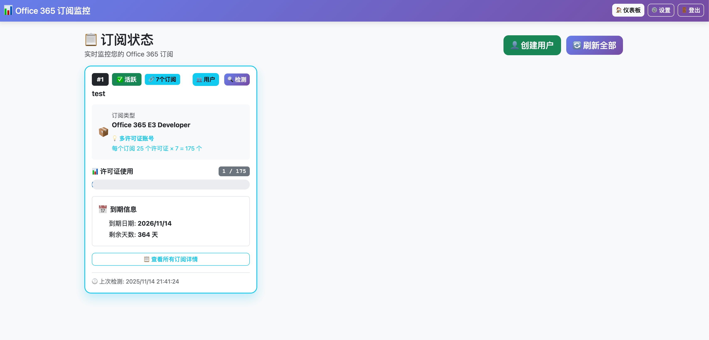
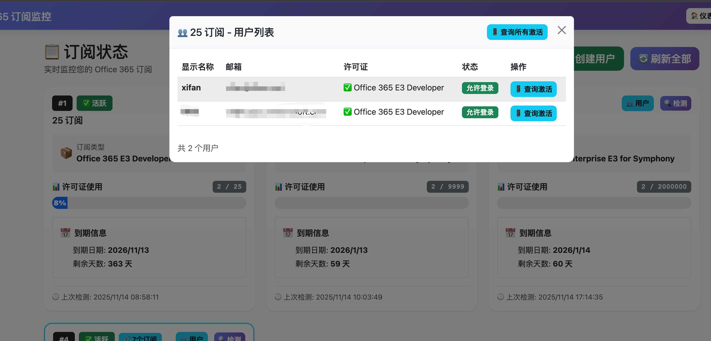
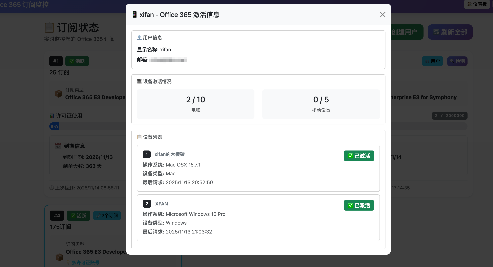

# Office 365 订阅监控系统

一个轻量级的 Office 365 订阅状态监控系统，支持自动检测、手动检测和异常通知。

## 使用方法

### 查看许可

1、获取抓包数据-输入后到仪表盘检测进行更新许可数量。

### 添加用户

2、获取抓包数据-输入后到仪表盘选择许可添加用户（需要设置填写 curl 值才能添加用户）

## 主要功能

- 📊 订阅状态监控
- 🔔 自定义 Webhook 通知
- 👤 用户管理
- 📱 设备激活查询
- ⏰ 定时检测（每24小时）

## 通知触发条件

系统会在以下情况自动发送通知：

1. **订阅即将到期** - 剩余天数 ≤ 30天
2. **订阅已失效** - 订阅状态为失效
3. **Cookie 失效** - 认证失败，需要更新 Cookie
4. **登录密码错误** - 有人尝试使用错误密码登录

## 安装步骤

1. 安装依赖：
```bash
pip install -r requirements.txt
```

2. 运行程序：
```bash
python app.py
```

3. 访问系统：
```
http://localhost:5000
```

## 默认登录信息

- **默认密码**: `xiaokun567`
- **首次登录后会强制要求修改密码**

## Webhook 配置

在设置页面配置 Webhook 通知：

### 配置示例

**Webhook 地址：**
```
https://your-webhook-url.com/api/notify
```

**请求体 JSON 模板：**
```json
{
  "title": "{title}",
  "text": "{通知消息}"
}
```

### 支持的变量

- `{title}` - 标题（固定为"订阅监控通知"）
- `{content}` 或 `{通知消息}` - 通知内容

### 示例配置

#### 1. 简单格式
```json
{
  "title": "{title}",
  "text": "{content}"
}
```

## 订阅管理

 获取 Curl 命令
### 许可证
1. 打开浏览器，访问 Microsoft 365 管理中心-许可证-许可点进去（多许可证就抓包这个搜索subscriptions）-管理订阅详细信息（单许可抓包这个搜索getSubscription）
2. 打开开发者工具（F12）
3. 切换到 Network（网络）标签
4. 刷新订阅页面，找到 `getSubscription - 单订阅模式` 请求或者subscriptions 请求 - 多许可证支持
5. 右键点击请求，选择 "Copy" -> "复制 curl （bash）格式"
6. 将复制的命令粘贴到添加订阅表单中
### 用户（可实现 web 界面快捷添加用户）
1.用户的 curl 抓包，到 Microsoft 365 管理中心 添加用户，配置用户名，勾选手动设置密码，勾选许可证。
2. 打开开发者工具（F12）
3. 切换到 Network（网络）标签
4. 刷新订阅页面，找到 ` user` 请求
5. 右键点击请求，选择 "Copy" -> "复制 curl （bash）格式"
6. 将复制的命令粘贴到添加订阅表单中

## 系统展示






其他就不展示了。
## 注意事项

- Cookie 会过期，需要定期更新
- 建议配置 Webhook 以便及时收到通知
- 首次登录后请立即修改默认密码
- 定时任务每24小时自动检测一次

## 技术栈

- Flask - Web 框架
- APScheduler - 定时任务
- Requests - HTTP 请求
- Bootstrap 5 - 前端UI

## 许可证

MIT License
